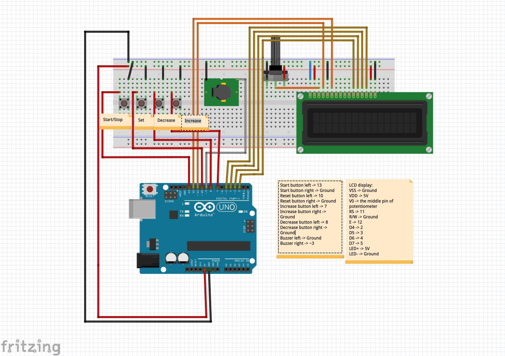

## Introduction

This project is a countdown timer implemented with Arduino.

I developed this project independently under online tutorials ([1](https://www.youtube.com/watch?v=nLfRUNcb0ZQ&t=1118s), [2](https://electronics-project-hub.com/arduino-countdown-timer-with-lcd-and-buzzer/), [3](https://arduinogetstarted.com/tutorials/arduino-lcd)) for guiding Year 1 students to finish their mini projects for the selection exam of the online summer school organized by the University of Bologna in 2021. 

## Required Software and Hardware

- Arduino IDE (The language in IDE is based on C/C++)
- Fritzing
- Arduino Uno
- Breadboard
- Liquid Crystal Display
- Potentiometer
- Buzzer
- Connection Cables
- Pushbuttons
- USB cable

## Connection Sketch

This connection sketch is generated in Fritzing.

## Demo Video

[demo video](https://www.youtube.com/watch?v=Bo6amTuG8Dc)

